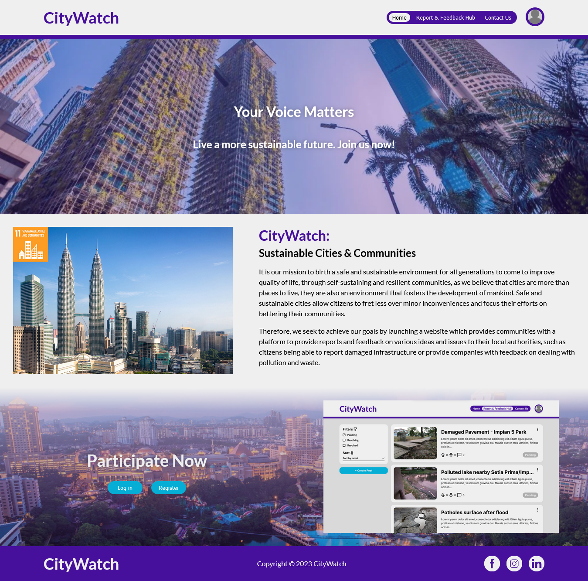
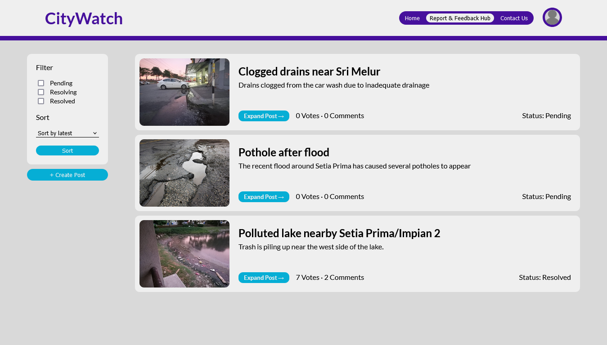
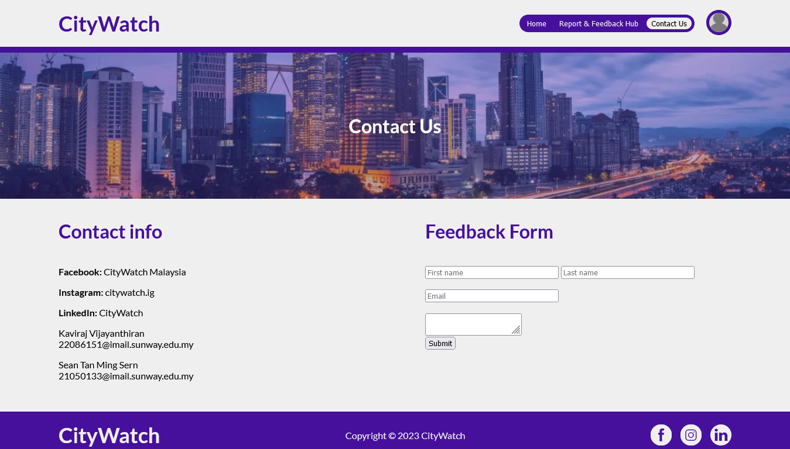
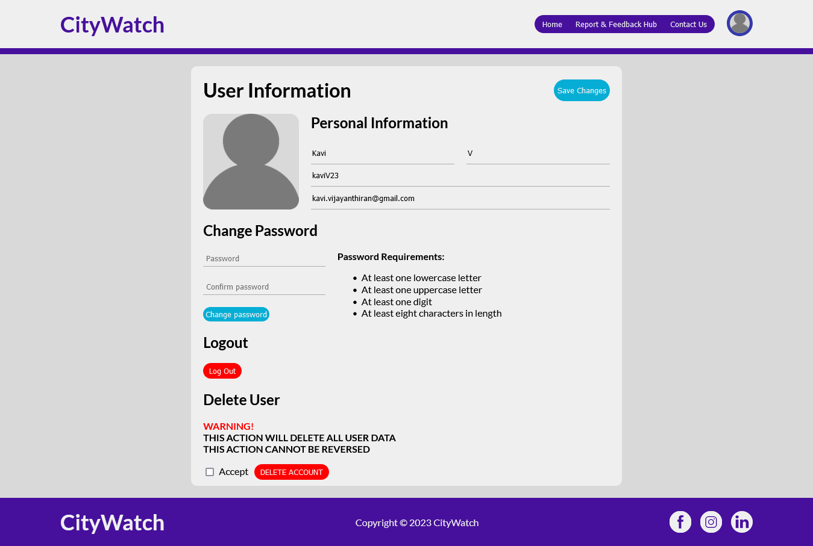

# CityWatch 🏠🏨🏗️


## 🐋 Install with Docker
Ensure docker is installed on your system. Then run the following command:  
```docker run --name CityWatch -p 41062:80 kaviv23/citywatch:latest```

After the container has been created, **wait another 10 seconds before visiting the website for the first time**:  
http://localhost:41062/www/CityWatch/home.php

## 🛠️ Manual Installation
To try out the website for yourself, you will need to install [XAMPP](https://www.apachefriends.org/) on your system. Then, place [this](https://github.com/KaviV23/CityWatch/) repository into XAMPP's htdocs folder. For example:

If XAMPP is installed at `C:\xampp`:
>C:\xampp\htdocs\CityWatch\

Then, open up XAMPP and start up the Apache and MySQL service.  
When running this project for the first time, you will need to first create a new database named ```CityWatch``` and import [`CityWatch-database.sql`](/CityWatch-database.sql) into it through [phpMyAdmin](http://127.0.0.1/phpmyadmin/) (make sure MySQL is running).

Finally, you will be able to access the website at http://127.0.0.1/CityWatch/home.php

## 🔑 Admin Account
To use the admin features, log in with the admin account:  
E-mail: ```admin@email.com```  
Password:```12345678```

## 🖼️ Screenshots
### Report & Feedback Hub


### Contact Us Page


### User Account Page

